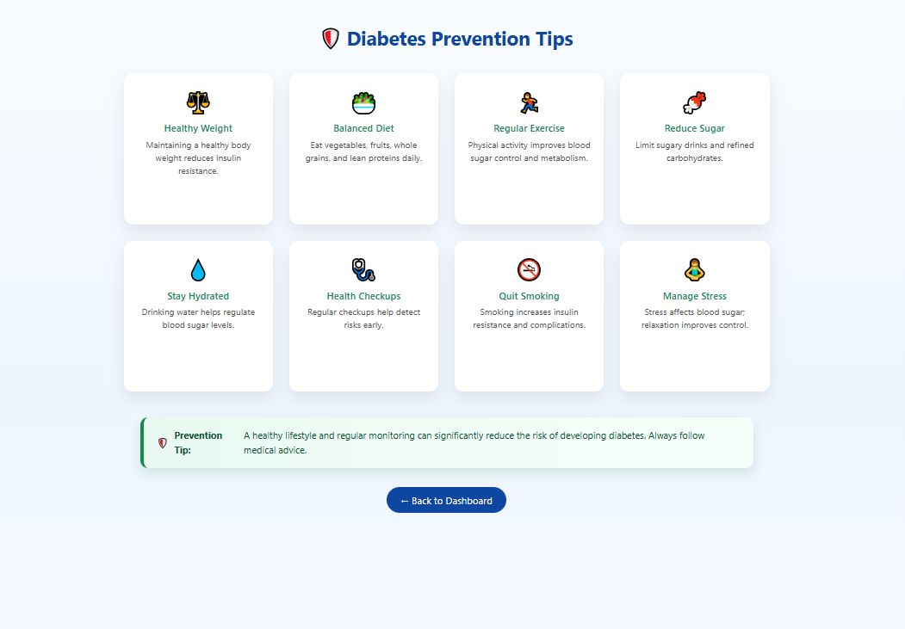

# Diabetes Prediction Flask App 🩺

A web-based machine learning application built with Flask that predicts the risk of diabetes based on user health inputs.

## 🚀 Features
- Diabetes risk prediction using ML
- User-friendly web interface
- Symptoms and prevention information
- Flask backend with trained model

## 🛠️ Tech Stack
- Python
- Flask
- Machine Learning (Scikit-learn)
- HTML, CSS

## ▶️ How to Run
1. Clone the repository  
git clone https://github.com/vaishnavig1020-debug/Diabetes-Prediction-Flask-App.git
2. Install dependencies  
pip install -r requirements.txt
3. Run the app  
python app.py
4. Open browser and go to  
http://127.0.0.1:5000/

## 📸 Application Screenshots

### 🏠 Home Page

### 🧪 Diabetes Prediction Form

### ⚠️ Symptoms Page

### 🛡️ Prevention Tips Page

## ⚠️ Disclaimer
This tool is for educational purposes only and does not replace professional medical advice.
